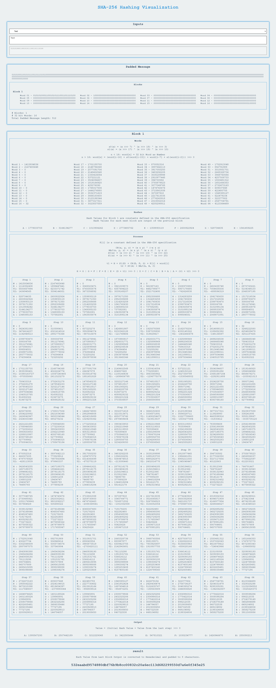

# Shark Project

Welcome to the Shark Project!

This is an innovative web application designed to provide a hands-on, interactive experience with SHA-256 hashing. It allows users to visually explore and understand the process of SHA-256 hashing by inputting data and observing the step-by-step transformation into a hash. This project is particularly useful for educational purposes, helping those new to cryptography grasp the complexities of hashing algorithms in a more intuitive way. Additionally, it serves as a practical tool for anyone interested in the mechanics of hash generation and cryptographic security.

https://interval-pro.github.io/smart-vision-pre/

## Getting Started

To get started with the Shark Project, clone the repository and install the dependencies:

```bash
git clone https://github.com/interval-pro/shark.git
cd shark
npm install
```
Open http://localhost:3000 to view it in your browser.

## Contributing

Everyone is welcome to contribute to the Shark Project. Whether it's suggesting new functionalities, fixing bugs, updating the design, or any other improvements, your input is highly appreciated.

We would also be extremely grateful if someone could create a guide or tutorial explaining how to use the application and what each part is for. This could be in the form of a video or a text document, and would be incredibly helpful for those not familiar with the project.

## Buy me a coffe
If you enjoy using the Shark Project and would like to show your support, consider buying me a coffee! Your support is greatly appreciated and helps me continue developing and maintaining this project.

BTC: 14ybhx8nBgaedn7NgKHuWgppd2tmj9En5f

TRX: TWSGartWS8q6LY7esw4MqGkgPaXNpNsq5u

## Contacts
dev.peshev@gmail.com

## Screenshot


## Note
This README file was generated with the assistance of AI.
